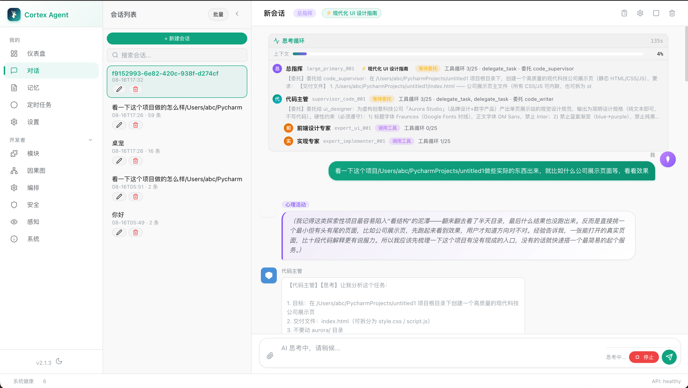

# Cortex Agent

**Language**: [English](./README.en.md) | [简体中文](./README.md)

> **Multi-model collaborative Agent system** — Model orchestration · Continuous thinking · Cognitive blackboard · Memory & causal reasoning · Security auditing · Multi-client interaction

Cortex Agent is an orchestratable multi-model Agent toolkit rather than a simple chatbot: it ships with an event-driven cognitive blackboard, structured memory with causal reasoning, tiered security gating, 85+ tools with MCP extensions, and provides **Web UI / Qt desktop client / desktop pet / terminal** as four interaction modes, supporting both multi-role Agent collaboration and a pure-chat (chatonly) route.

---

## Core Highlights

| | Highlight | Description |
|---|---|---|
| **Cognitive Blackboard** | Event-driven, eliminates the N² complexity of multi-Agent setups | Single source of truth + hierarchical context slicing; every turn is fully isolated, reducing duplicate replies and context pollution |
| **Multi-model three-tier orchestration** | Large → Supervisor → Expert parallel collaboration | Strategic decisions → task decomposition → parallel expert execution; results converge on the blackboard where the commander-in-chief integrates them |
| **Continuous thinking engine** | More than "input → output" | Multi-round ReAct iterations with a complexity-adaptive thinking budget; the model autonomously decides whether to keep thinking / delegate / answer |
| **Dual conversation modes** | Agent orchestration and pure chat (chatonly) | Pure chat runs a lightweight engine with a single persona; Agent mode features multi-role collaboration with frontend-editable/customizable roles |
| **Memory + causality** | Event memory + causal graph reasoning | Sessions are distilled into structured events (SQLite+FAISS); causal-tree deep recall retrieves memories along causal chains |
| **Multi-client interaction** | Web / Qt desktop / desktop pet / TUI | Vue 3 Web UI, PyQt6 desktop client, Live2D desktop pet, Textual terminal |
| **Fail-closed security** | Tiered approval + full-chain audit | Tool calls pass tiered gating (LOW/HIGH/CRITICAL); permission/interception anomalies are always rejected (never silently allowed) |
| **Tool system** | 85 built-in + MCP + runtime self-built | File/search/perception/code execution/UI inspection; extension via MCP servers; the model can build tools at runtime |
| **Engineering assurance** | **5800+ tests · 99% coverage · mypy 0 errors** | Memory-leak detection enabled by default + watchdog; independent MCP hot-plugging + auto-reconnect; dependency-injection ports; five CI gates |

---

## Architecture Overview

```
                        ┌──────────────────────────────────────────┐
   User Input ────────► │  Cortex entry point (cortex/ CLI / UIs)  │
                        └─────────────────────┬────────────────────┘
                                              ▼
                      ┌──────────────────────────────────────────────────┐
                      │  FastAPI + WebSocket/SSE (api/)                  │
                      │  ├── Agent mode → multi-model tiered orchestration│
                      │  ├── chatonly mode → lightweight engine          │
                      │  └── Admin API (orchestration/persona/…)         │
                      └─────────────────────┬────────────────────────────┘
                                            ▼
    ┌─────────────────────┬───────────────────┼─────────────────────┬─────────────────────┐
    ▼                     ▼                   ▼                     ▼                     ▼
CognitiveBlackboard  Memory System      Security Gate          Perception            Tool System
(event-driven board) EventStore+FAISS  fail-closed approval  Screen/OCR/Voice          85+ / MCP
    │                 CausalGraph     full audit chain       diff detection         / create_tool
    └─────────────────────┴───────────────────┴─────────────────────┴─────────────────────┘
```

### Multi-Model Three-Tier Orchestration

```
User input
   ↓
[Large model] ← strategic decisions, key judgments, final integration
   ↓ decompose into subtasks (delegate_task)
[Supervisor] ← N supervisors in parallel (code / creative / query …)
   ↓ assign experts (probe_start)
[Expert] ← N×M experts executing in parallel
   ↓ results converge
[CognitiveBlackboard] → [Large model integrates and produces the final answer]
```

### Event-Driven Blackboard (Why There Is No N² Complexity)

Traditional multi-Agent setups have every Agent read the full history → duplicate replies, timeouts, context pollution. Cortex uses `CognitiveBlackboard` as the single source of truth, with `ContextSlicer` slicing context by tier:

- **Large** sees global goals, plans, risks, delegations, and findings
- **Supervisor** sees task goals and available tools
- **Expert** sees only the current step, tool state, and the last 5 execution steps

Cross-module communication goes only through the MessageBus / CognitiveBlackboard / Protocol interfaces, with dependency direction strictly L3→L4.

### Four-Layer Architecture

| Layer | Path | Responsibility |
|------|------|------|
| L1 Entry | `cortex/` | CLI entry, subprocess orchestration, version management |
| L2 API | `api/` | FastAPI, WebSocket/SSE streaming, middleware (CORS/auth/rate limiting/request ID) |
| L3 Business | `modules/` | 9 business modules (thinking, memory, security, perception, output, management, database, desktop pet, cortex) |
| L4 Infrastructure | `infra/` | Model clients, tool registration/management, MCP, data processing, hardware input |

### Dual Conversation Modes

| Mode | Engine | Traits |
|------|------|------|
| **Agent (default)** | `modules/thinking/core/` | Multi-role collaboration, probe-driven activation, parallel experts |
| **Pure chat (chatonly)** | `modules/thinking/chat_light/` | Lightweight single persona; system prompt supports persona/system overrides; a custom commander agent persona takes effect automatically |

---

## Quick Start

### One-Click Install

**macOS / Linux**
```bash
curl -fsSL https://raw.githubusercontent.com/15087312/cortex_agent/main/install.sh | bash
```

**Windows (PowerShell)**
```powershell
iex (New-Object Net.WebClient).DownloadString('https://raw.githubusercontent.com/15087312/cortex_agent/main/install.ps1')
```
If execution policy is restricted, run first: `Set-ExecutionPolicy -ExecutionPolicy RemoteSigned -Scope CurrentUser -Force`

After installation, run `cortex`.

### Manual Install

```bash
git clone https://github.com/15087312/cortex_agent.git
cd cortex_agent
pip install -e .
cp .env.example .env        # Edit and fill in your API key
```

### Running Each Client

| Client | Command | Description |
|----|------|------|
| **Backend + TUI** | `cortex` | One-command start (API + Textual interactive terminal); `Ctrl+C` to exit |
| **Backend (headless)** | `cortex --no-tui` | API-service-only mode |
| **Web UI (dev)** | `cd frontend && npm run dev` | Vite HMR, default port 5173, proxies `/api` → 8080 |
| **Web UI (production)** | `python frontend/server.py` | Static server, default port 8765 |
| **Qt desktop client** | `python frontend/main.py` | macOS PyQt6+QtWebEngine; auto-launches the desktop pet |
| **Desktop pet** | Enable with `DESKTOP_PET_ENABLED=true` | Standalone process `pet_launch.py`; transparent always-on-top Live2D window |
| **Remote connection** | `cortex --api-url http://192.168.1.100:8080` | Connect to an existing backend |

**Frontend API conventions**: all requests use the `/api/` prefix (the proxy strips the prefix to port 8080); WebSocket connects directly to
`:8080/stream/ws/{session_id}`; `/audio` and `/pet` resources keep bare paths.

---

## Interaction Clients

<!-- UI screenshot: drop an image at docs/images/ui_chat.png and it will appear here automatically -->
<p align="center">
  
</p>

### Web UI (Vue 3)

15 pages: Chat (multimodal attachments/streaming/thinking panel/todos/approval banner), Orchestration (role orchestration/personas/tool permissions/
activation toggles), Dashboard, Memory, Settings, Skills/Tools/Modules, ScheduledTasks/Outreach, Perception/
Security/System/Graph/Causal.

### Qt Desktop Client (macOS)

`frontend/main.py`: PyQt6 + QtWebEngine; starts server.py in the background and embeds the Web UI in a Qt window; closing hides to the Dock,
`Cmd+Q` quits; native `confirm()/prompt()` would block QtWebEngine, so the frontend always uses in-page dialogs.

### Desktop Pet (Live2D)

Live2D character + standalone process + Qt transparent always-on-top window: drag to move, click the character for an interaction menu, press F8 or say the wake word "科特" to trigger conversation in the main session;
bound to a fixed main session `pet_main`, with persistent conversation memory and TTS voice replies.

### Terminal (TUI)

Textual interactive terminal launched via `cortex`, supporting multimodal files and streaming replies.

---

## Feature Modules

### Memory System

At session end, an LLM distills the conversation into structured events stored in SQLite+FAISS for vector retrieval, and builds a causal graph supporting multi-hop reasoning.

| Component | Role |
|------|------|
| **EventReducer** | Distills sessions into MemoryEvents (fact/thought/lesson/keywords) |
| **EventStore** | SQLite + FAISS storage and vector retrieval |
| **EventRetrieval** | Hybrid retrieval (semantic×0.35 + importance + recency + usage/mention frequency) |
| **CausalGraph / CausalTree** | Event causal graph + causal-tree deep recall |

### Security System

- **Multi-layer defense**: input checks → execution review (tiered approval LOW/MEDIUM/HIGH/CRITICAL) → output review → complete audit chain
- **Fail-closed**: exceptions in permission/security interception checks are always rejected, never silently allowed (3 historical fail-open bugs fixed)
- **Dangerous-command detection**: extremely dangerous commands are hard-blocked (rm -rf /, pipe-to-shell download-and-execute, etc.)

### Tool System

| Tier | Source | Description |
|------|------|------|
| **ToolRegistry (built-in)** | `infra/tool_manager/` | 85 built-in tools |
| **MCP (remote)** | `infra/mcp/` | MCP servers connected via stdio/SSE |
| **create_tool (runtime self-built)** | Created dynamically at runtime | Persisted to disk |

Everything is routed through `MCPToolService`; built-in tools win on name conflicts; all calls pass security permission checks.

### Perception System

Window changes / screen diffs / OCR / voice / file-change detection with 1Hz heartbeat diff sources, driving proactive outreach and desktop-pet interactions.

---

## Execution Modes & Configuration

| Execution mode | Behavior |
|----------|------|
| `plan` | Read-only; all write operations forbidden |
| `edit` | Write operations require user confirmation |
| `yolo` | Security-expert detection only; skips user confirmation |
| `control` | MEDIUM+ tools require individual user confirmation |

Other key configuration: `PERCEPTION_ENABLED`, `DIFFERENCE_DETECTOR_ENABLED`, `PROACTIVE_OUTREACH_ENABLED`,
`SECURITY_REVIEW_MODE`, `CORTEX_MODE` (agent/chatonly), `DESKTOP_PET_ENABLED`, etc.
See [.env.example](.env.example) and [docs/CONFIG_VALUE_EVOLUTION.md](docs/CONFIG_VALUE_EVOLUTION.md) for the full configuration.

---

## Project Structure

```
ai_backend/
├── cortex/                 # CLI entry point (cortex command)
├── api/                    # FastAPI app + WebSocket/SSE + admin API
├── frontend/               # Vue 3 frontend + Qt desktop client + desktop pet
│   ├── src/                # Web UI source (15 pages)
│   ├── pet/                # Desktop pet Live2D frontend
│   ├── main.py             # macOS desktop client (PyQt6 + QtWebEngine)
│   ├── pet_launch.py       # Desktop pet standalone process
│   ├── pet_widget.py       # Desktop pet transparent always-on-top window
│   └── server.py           # Static server (port 8765, proxies /api)
├── modules/                # Business modules
│   ├── thinking/           # Orchestration engine (core / chat_light / cognition / communication / probes / skills)
│   ├── memory/             # Event memory + causal graph
│   ├── security_system/    # Security gating (fail-closed) + audit
│   ├── perception/         # Perception system
│   ├── desktop_pet/        # Desktop pet engine
│   ├── output_system/ management/ database/ cortex/
├── infra/                  # Model clients / tools / MCP / data processing / hardware input
├── config/                 # Pydantic Settings + providers (model format adapters) + prompts
├── cli_tui/                # Textual TUI
├── utils/                  # Shared utilities
├── tests/                  # 137 test files (unit/integration/external)
├── docs/                   # Documentation (architecture/memory/fix logs)
├── scripts/                # Deployment & ops (incl. fix_macos_libomp.py)
└── data/                   # Runtime data
```

---

## Tech Stack

| Category | Technologies |
|------|------|
| Backend | Python 3.11+ / FastAPI / Uvicorn / aiohttp / httpx |
| Models | DashScope / OpenAI / Anthropic (unified format adaptation via `config/providers`) |
| Frontend | Vue 3 / Vite 6 / Pinia / Vue Router / Vitest |
| Desktop | PyQt6 + QtWebEngine (macOS) |
| Desktop pet | Live2D + TTS |
| Data | SQLite / DiskCache / JSONL / FAISS |
| NLP/ML | jieba / sentence-transformers / PyTorch / transformers / faiss / mlx-lm (optional) |
| Search | DuckDuckGo / Sogou / Bing / Baidu |
| Deployment | Docker / Docker Compose / PyInstaller |

---

## Testing & Engineering Quality

**All 5800+ tests pass with 99% code coverage** (unit / integration layers; 20+ core files at 100%).

```bash
# Full backend suite (recommended)
pytest tests/ -m "not external and not slow"

# Type check (CI gate; 229 source files, 0 errors)
mypy modules/ infra/ config/ utils/ api/

# Leak-detection capability verification (10 leak test classes)
python scripts/verify_leak_detection.py

# Precise memory-leak localization
python scripts/leak_check.py tests/unit/test_xxx.py

# Frontend
cd frontend && npm test
```

### Quality System (Five CI Gates)

| Gate | Details |
|---|---|
| **Unit tests** | `pytest tests/unit` (5800+ cases; random hangs eradicated) |
| **Coverage gate** | `--cov-fail-under=70` (actual: 99%) |
| **Type check** | `mypy` 0 errors (configured in `pyproject.toml [tool.mypy]`) |
| **Leak detection** | Enabled by default: muppy byte-sampling trend detection + pympler type diff (including raw bytes/numpy memory) |
| **Memory watchdog** | Auto-terminates when exceeding `CORTEX_TEST_MEM_LIMIT_MB` (active only when explicitly set), protecting local machines/CI |

### Test Coverage Scope (Including the Frontend Proxy Layer)

| Layer | Covered | Notes |
|---|---|---|
| Backend | `modules/infra/utils/config/api/cortex` | 99% coverage, mypy, leak detection, module coverage manifest |
| **Frontend proxy layer** | `frontend/server.py` / `pet_widget.py` | Included in the module coverage manifest + tests (`test_frontend_server.py`) |
| Frontend JS | `frontend/src` (vitest) | Component/API tests |
| Qt GUI launchers | `frontend/main.py` / `pet_launch.py` | Exempt (no display environment in CI) |

The **module coverage manifest** proves that all production modules (including the frontend proxy layer) are executed by tests (`[MODULE-COVERAGE]`).

### Key Engineering Practices

- **Memory safety**: detection (`[LEAK-DETECT]` reports) + verification (`tests/leak/` with 10 leak test classes, 10/10 identified) + localization (`leak_check.py` RSS monitoring) + termination (watchdog). The module coverage manifest proves all production modules (including the frontend proxy layer) are executed by tests.
- **Dependency injection**: capability ports in `infra/tool_manager/service_registry.py` + assembly layer in `bootstrap.py` + startup-time missing-dependency validation — reverse dependencies from `infra→modules` reduced to zero.
- **MCP lifecycle**: independent hot-plugging (`remove_server`/`replace_server`) + automatic reconnection with exponential backoff — aligned with the dsh mcp-client.
- **Background thread safety**: class-level `weakref` registries for screen sources/event buses/voice detection + unified conftest cleanup, eliminating random test hangs.
- **Dependency injection**: capability ports in `infra/tool_manager/service_registry.py` + assembly layer in `bootstrap.py` + startup-time missing-dependency validation — reverse dependencies from `infra→modules` reduced to zero.
- **MCP lifecycle**: independent hot-plugging (`remove_server`/`replace_server`) + automatic reconnection with exponential backoff — aligned with the dsh mcp-client.
- **Background thread safety**: class-level `weakref` registries for screen sources/event buses/voice detection + unified conftest cleanup, eliminating random test hangs.
- **Isolation principle**: never touch production databases (temporary SQLite + monkeypatched singletons); relaxed timeouts when loading heavy libraries; `except: pass` error swallowing forbidden; test fakes must match real model fields.
- **Bug log**: `docs/ERRORS_AND_FIXES.md` (§1-38, including systematic pattern audits); see `docs/MEMORY_LEAK_TESTING.md` for the memory-safety framework.

---

## API Endpoints

| Endpoint | Description |
|------|------|
| `GET /health` | Health check (healthy / degraded) |
| `GET /` | System info and version |
| `WS /stream/ws/{session_id}` | WebSocket real-time conversation (streaming/attachments/approvals) |
| `GET /stream/sse/{session_id}` | SSE streaming conversation |
| `GET /config` / `PUT /config/{key}` | Config read/write (whitelist + API key) |
| `PUT /config/persona/{role}` | Persona / system prompt overrides |
| `POST /management/orchestration/agents` | Custom Agents (with tier/model/persona) |

---

## Docker Deployment

```bash
docker-compose up -d      # Build and start (4GB RAM, 2 CPU)
docker-compose logs -f app
docker-compose down
```

---

## Release

### Bump Version & Tag

```bash
python scripts/release.py patch --tag --push    # 2.0.0 -> 2.0.1, commit + tag v2.0.1 + push
```

The script automatically syncs `VERSION` and `frontend/package.json`. After the tag is pushed, GitHub Actions
(`.github/workflows/release.yml`) automatically builds on Windows / macOS and uploads portable packages to the Release.

### Build Artifacts (`dist/CortexAgent/`)

PyInstaller produces two executables in a single run (`pyinstaller pyinstaller.spec --clean --noconfirm`):

| Executable | Purpose |
|-----------|------|
| `Cortex_Client(.exe)` | Desktop client (PyQt6 + QtWebEngine); launch by double-click |
| `AI_Backend(.exe)`    | Backend API (uvicorn), auto-launched by the client (same directory) |

The client bundles the Vue build output `frontend/dist` (run `cd frontend && npm run build` before releasing).

### First-Run Notes

- **Embedding model** (~500MB): downloaded automatically at startup when the cache is missing (set the `HF_MIRROR` environment variable to speed things up, e.g. `hf-mirror.com`).
- **Vision model**: `VISION_BACKEND` defaults to `local` (downloads larger models); use `VISION_BACKEND=mock` or `api` to skip local loading.
- On Windows, if SmartScreen blocks the first run, choose "More info → Run anyway".

---

## Documentation

| Document | Description |
|------|------|
| [docs/ARCHITECTURE.en.md](docs/ARCHITECTURE.en.md) | Detailed architecture design |
| [docs/THINKING_ARCHITECTURE.en.md](docs/THINKING_ARCHITECTURE.en.md) | Thinking module internals (dual-layer ReAct loop) |
| [docs/MEMORY_INJECTION.en.md](docs/MEMORY_INJECTION.en.md) | Memory system and injection pipeline |
| [docs/CONFIG_VALUE_EVOLUTION.en.md](docs/CONFIG_VALUE_EVOLUTION.en.md) | Value-evolution configuration |
| [docs/ERRORS_AND_FIXES.en.md](docs/ERRORS_AND_FIXES.en.md) | Error causes and fix records (§1-§27, incl. fake-test/security/coverage lessons) |
| [frontend/ARCHITECTURE.en.md](frontend/ARCHITECTURE.en.md) | Frontend architecture |
| [frontend/README.en.md](frontend/README.en.md) | Frontend usage/development |

> 🌐 All documents are also available in Chinese with the `.md` suffix (e.g. [docs/ARCHITECTURE.md](docs/ARCHITECTURE.md)); every document has a language switcher at the top.

---

## License

[Apache License 2.0](LICENSE)
